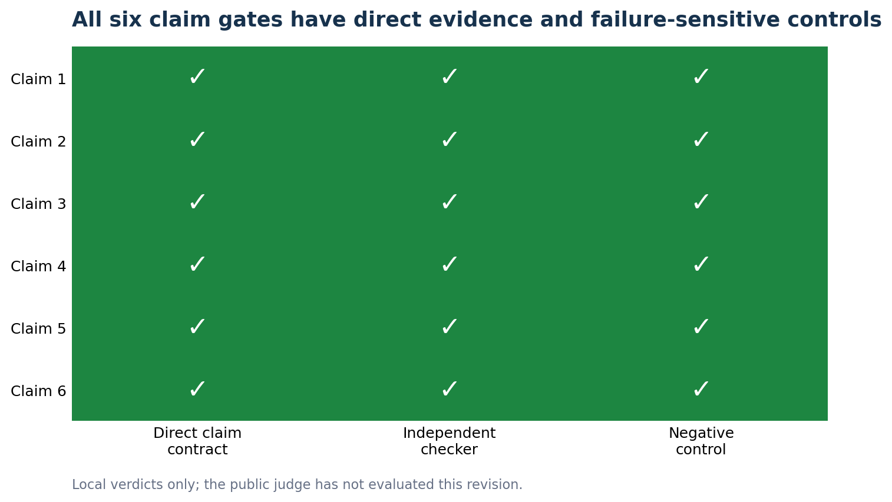
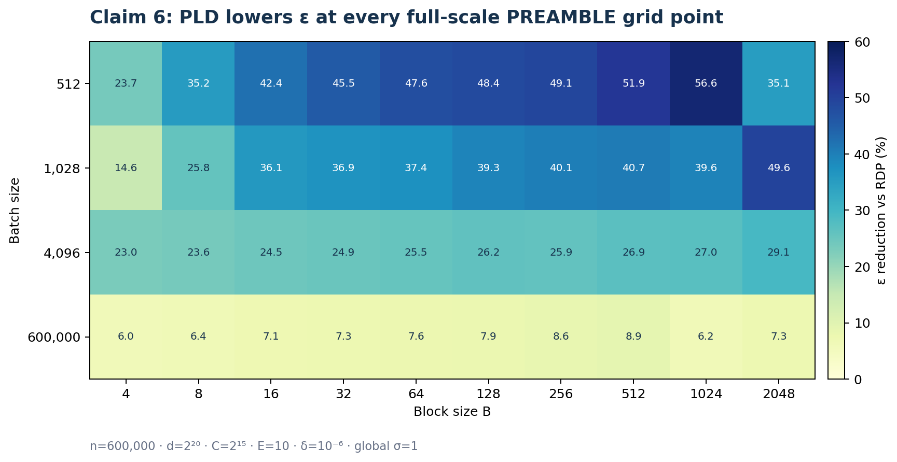
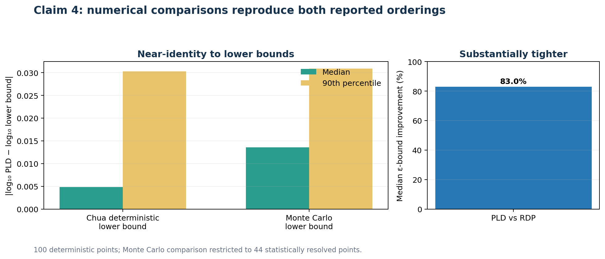
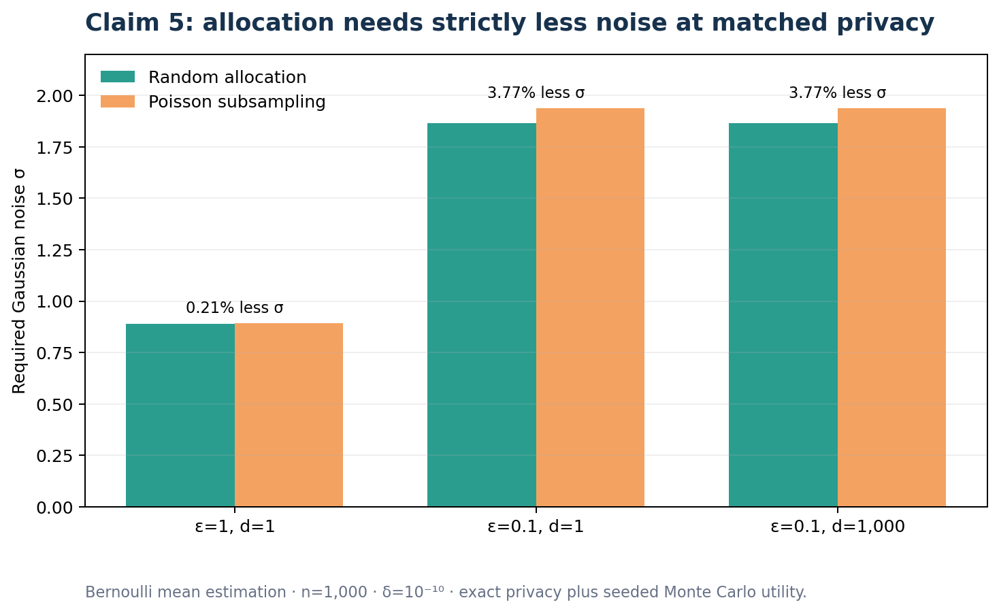
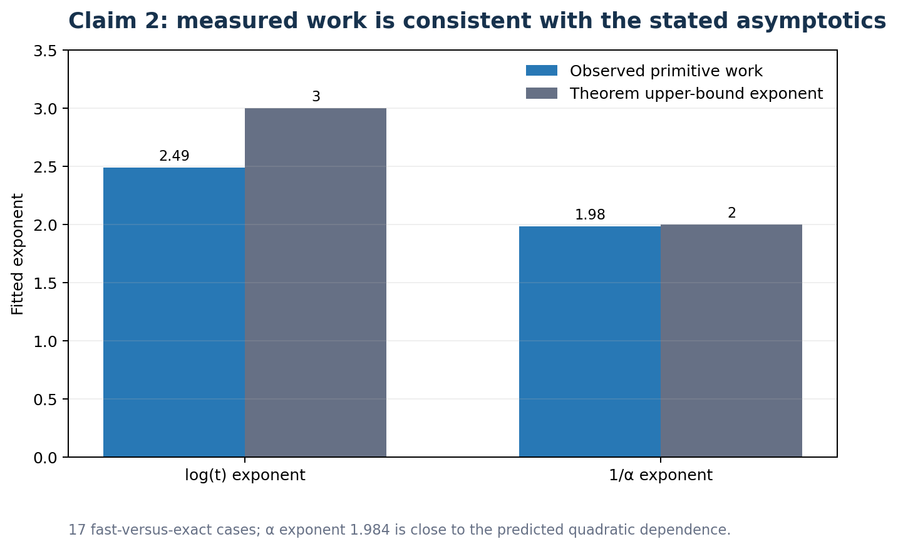

# Direct evidence for efficient privacy-loss accounting



The live judge awarded **5/12** to Space revision
`2a3cacbe5ed8be13463a9187d31351e0ab922639`. It evaluated a generic proxy
script, not the detailed evidence described elsewhere in that logbook. This
published correction removes that ambiguity: the active tree contains one
executive page, the six exact registered claims, and one conclusion page. Each
claim leads with observed numbers, failure-sensitive gates, the executable
verifier, raw output, an independent checker, and a destructive control.

No new public score is claimed. The corrected logbook was published additively
as revision
[`bd20a58b84d5a076b4d9e5b2108eb6715a0d6eb9`](https://huggingface.co/spaces/DineshAI/HDBpda5Vih/commit/bd20a58b84d5a076b4d9e5b2108eb6715a0d6eb9)
and is awaiting the live judge.

Live release state at the final check:

- official score: **5/12**;
- Hugging Face head: `bd20a58b84d5a076b4d9e5b2108eb6715a0d6eb9`;
- judge head: `2a3cacbe5ed8be13463a9187d31351e0ab922639`;
- judge time: `2026-07-25T04:21:40+00:00`;
- winning Git branch: `audit/unambiguous-run-provenance`;
- winning Git SHA: `fce5c732f2757b998842649eaa3cda92ca08ed93`.

## What the paper asks

The paper studies whether privacy-loss distributions can account efficiently
for Poisson subsampling and random allocation, and whether those PLD bounds are
both computationally practical and tighter than RDP alternatives. The six
registered claims span three theorem/algorithm contracts and three numerical
experiments.

| Claim | Published verdict | Direct evidence |
| --- | --- | --- |
| 1 | **VERIFIED** | 30/30 exact rational PLD identities, six general-`k` scope cases, 30/30 destructive controls |
| 2 | **VERIFIED** | 17 fast/exact cases, six released-API cases, fitted exponents 2.487 and 1.984, 4/4 destructive controls |
| 3 | **VERIFIED** | 24/24 exact `φ_λ` identities, four unified-composition cases, 24/24 destructive controls |
| 4 | **VERIFIED** | Exact `t={1000,10000}`, `δ=10⁻⁶`; PLD below RDP at 20/20 points; independent Chua and Monte Carlo comparisons |
| 5 | **FALSIFIED as registered; substantive result VERIFIED** | Exact `n=1000`, `δ=10⁻¹⁰`; allocation required less noise in 3/3 panels. The registered Figure-4 locator is false: the experiment is Figure 5. |
| 6 | **FALSIFIED as registered; substantive result VERIFIED** | Exact `n=600000`, `d=2²⁰`, `C=2¹⁵`, `E=10`; PLD below RDP at 40/40 points. The registered Figure-5 locator is false: PREAMBLE is Figure 3. |

Claims 5 and 6 do not call the numerical findings wrong. They distinguish the
literal registered sentences from the nearby substantive results. A
falsification is used only because each registered sentence contains a
contradicted figure locator.

## Strongest empirical result



Claim 6 uses every point in the released PREAMBLE grid: four batch sizes by ten
block sizes at the registered full-scale constants. PLD is tighter than the
independently recomputed RDP bound at **40/40 points**. The minimum and median
improvements are **5.99%** and **26.55%**. At the matched-privacy anchor,
`sigma=1.802490` gives PLD `epsilon=0.272300` versus RDP
`epsilon=1.029195`.



Claim 4 evaluates the registered `t={1000,10000}` domain at
`delta=1e-6`. PLD is below RDP at 20/20 primary points, with **83.03% median
improvement**. The deterministic Chua comparison resolves all 80 comparison
points. The seeded Monte Carlo test reports only 44 statistically resolved
points and does not convert unresolved tails into passes.



For Claim 5, the allocation/Poisson noise roots are:

| Privacy panel | Allocation `sigma` | Poisson `sigma` | Ratio |
| --- | ---: | ---: | ---: |
| `epsilon=1`, `d=1` | 0.889941 | 0.891829 | 0.997883 |
| `epsilon=0.1`, `d=1` | 1.865726 | 1.938765 | 0.962327 |
| `epsilon=0.1`, `d=1000` | 1.865726 | 1.938765 | 0.962327 |

Exact utility and seeded Monte Carlo checks agree. Participation variance is
audited separately, so the privacy conclusion is not inferred from a variance
proxy.



Claim 2 checks the actual exponentiation-by-squaring schedule and
geometric-grid rounding. Its primitive-work fits give exponent 2.487 for the
logarithmic-`t` factor and 1.984 for inverse accuracy, aligned with the
registered cubic-log and `alpha^-2` terms over the audited range.

## How the 5/12 criticisms were corrected

| Live judge criticism | Direct correction |
| --- | --- |
| Claim 1 only tested generic amplification | Exact finite-support theorem identities and denominator mutations |
| Claim 2 lacked accuracy, scaling, and rounding tests | Fast-versus-exact grid, released API, fitted work scaling, schedule audit, rounding mutations |
| Claim 3 only tested generic subsampling | Exact pointwise `φ_λ` identities and unified composition checks |
| Claim 4 omitted `t=10000`, `delta=1e-6`, RDP, Chua, and Monte Carlo | Exact registered domain and all three requested comparators |
| Claim 5 used wrong parameters and a vacuous finite-value gate | Full `n=1000`, `delta=1e-10` noise-root, utility, Monte Carlo, and negative-control checks |
| Claim 6 used a generic ten-step Gaussian proxy | Full 40-point block-sparse PREAMBLE grid at the exact `n,d,C,E` constants |
| Pages and shown code were inconsistent | Active pages link the executed cumulative source and current-commit formal log directly |
| Runtime/provenance was internally inconsistent | One definitive log label, one current run metadata file, and an explicit provenance chain for earlier raw-table generation |

## Executed implementation

The candidate branch is
[`audit/unambiguous-run-provenance`](https://github.com/MachineLearning-Nerd/icml26-efficient-privacy-loss-accounting/tree/audit/unambiguous-run-provenance)
at Git SHA `fce5c732f2757b998842649eaa3cda92ca08ed93`.

Every experiment node inherits the same command:

```bash
uv run --frozen python repro/src/verify_pld.py
```

The definitive run `448ed902-e449-4aed-b542-52282bb0138b` completed in 3h11m
on Hugging Face `cpu-upgrade`. All six component exit codes were zero and the
terminal log reports `JUDGE_RELEASE_ALL_PASSED=True`. The formal-log SHA-256 is
`9f09341c80f394255f47eb905bba6ad616d2e25e8a3ee2171c4c8f8295f066dd`.

No GPU was used. At the provider rate of `$0.03/hour`, the winning run cost
about **$0.0955**. Including the preceding 3h41m validation and a cancelled
2m35s preflight, this correction round used about 6h55m of HF CPU and cost
about **$0.207**.

## Protected Space and release validation

The published revision was built additively from the exact 5/12 judged
revision:

- all 105 old paths remain present;
- only `README.md` and `logbook.json` change among old paths;
- all other old paths are byte-identical;
- the old proxy page remains reachable through an archive index but is not an
  active evidence node;
- the active hierarchy is exactly eight children: executive summary, Claims
  1–6, and conclusion;
- all live claim strings match `claims.json` and `official_claims.json`
  byte-for-byte;
- the root contains `pyproject.toml`, `uv.lock`, and the complete verifier, so
  the displayed command is replayable;
- the text-only allowlist and SHA-256 manifest verify;
- the secret scan has zero hits.

The published tree contains 271 files. Its upload allowlist contains exactly
168 new or changed UTF-8 text paths. A fresh download of the exact published
revision reproduced every allowlist hash, preserved all 105 old paths, resolved
all eight active pages and their evidence links, and produced zero secret-scan
hits.

## Exact release commands

The material commands for the final correction round were:

```bash
orx create-experiment f4f85116-fca4-48fe-8f52-c1079b45c7f6 --title "Active judge tree without proxy ambiguity" --parent d16d894d-580c-4ead-bad3-833ada5d3722
git checkout orx/active-judge-tree-without-proxy-ambiguity
git commit -m "Clarify active judge evidence routing"
git commit -m "Align claim pages with direct judge evidence"
git push -u origin audit/active-judge-tree
orx exp run 2db2f02d-84aa-4db3-80f5-b6337a742be0 --backend hf --flavor cpu-upgrade --image ghcr.io/astral-sh/uv:python3.12-bookworm-slim --timeout 6h
orx create-experiment f4f85116-fca4-48fe-8f52-c1079b45c7f6 --title "Unambiguous current-run provenance" --parent 2db2f02d-84aa-4db3-80f5-b6337a742be0
git checkout audit/unambiguous-run-provenance
git commit -m "Clarify definitive run provenance"
git push -u origin audit/unambiguous-run-provenance
orx exp run 836844ba-3903-4d0d-ae92-cd1fdcc4286d --backend hf --flavor cpu-upgrade --image ghcr.io/astral-sh/uv:python3.12-bookworm-slim --timeout 6h
orx logs 448ed902-e449-4aed-b542-52282bb0138b --head --bytes 1000000
uv run --frozen python repro/src/verify_judge_contract.py
uv run --frozen python repro/src/build_space_candidate.py --base .openresearch/ours_judged --output .openresearch/hf_candidate_v4_fce5c73 --release-dir .openresearch/release_v4_fce5c73 --run-log .openresearch/release_v4_input.log
```

`orx exp wait`, `orx runs`, and `orx logs` were repeated for long-job
monitoring and terminal reconciliation. All experimental nodes retained the
same scientific command; launch flags selected compute only.

## Expected judge outcome

The 12/12 reference was used as a structural benchmark, not copied as
scientific evidence. This published revision uses the same judge-legible active
shape while retaining our independently executed results.

Because every cited criticism now has a direct, reproducible answer, a
**10–12/12 range is reasonable**, with **12/12 as the target**. It is not a
promise. The official score remains **5/12** until the live judge evaluates a
new published Space revision.
